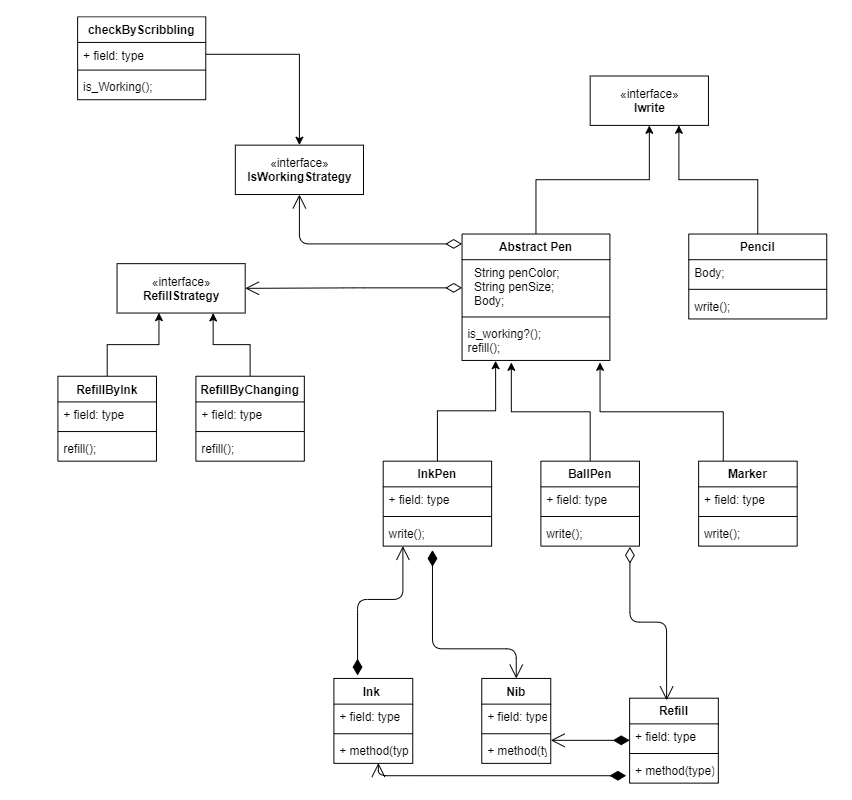

# Pen_Low_Level_Design

Description
-----------
Low level design for creation of different types of pen
Code has been written in JAVA

Requirements
-------------

1) Design a pen with feature to write.
2) Anything that has a nib and can write with visible ink is pen
3) You can assume that user uses appropriate surface for writing 
4) Different types of pen have different writing behaviour for Eg - Ink pen writes different than Ball pe
5) Refill should be supported. Implement refill();
6) User should be able to check if pen is working. Implement isWorking();

Future Scope 
-------------

1) User should be able to add various types of pen for eg - Sketch pen, Marker
2) User should be able to use refill() in different ways 
3) System should be extensible to add pencil, quill or non pen items that can write

Class Diagram 
--------------

